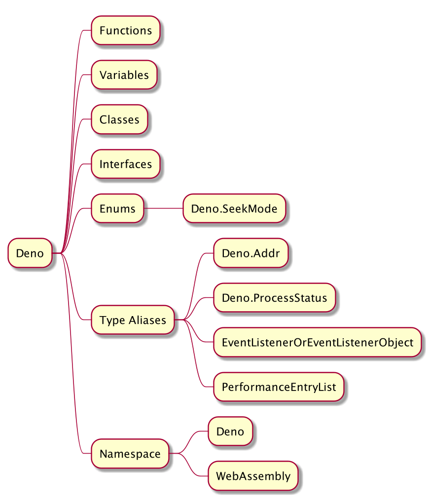
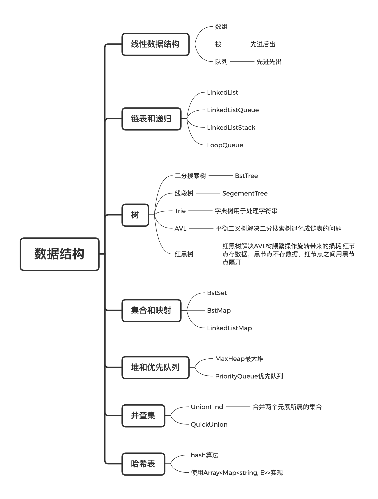
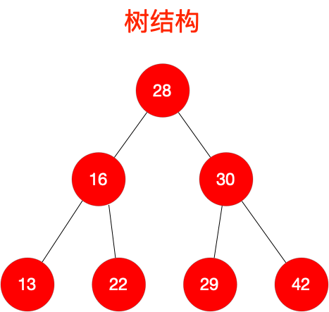
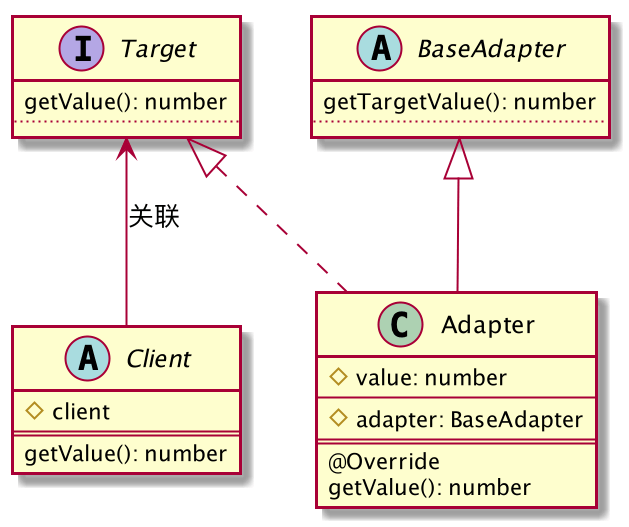
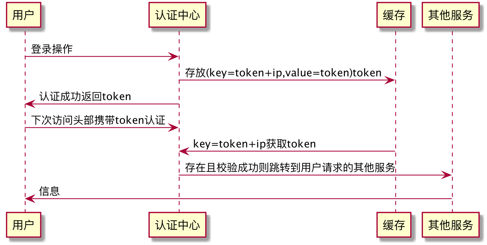

# design-patterns

使用`Deno`理解设计模式

## Deno Start

<p align="center">
  <a href="https://deno.land/">Install Deno</a>
</p>



```typescript
// start
    deno run -A ${fileName}

    class Node {
        // 私有属性以 `#` 开头, ES2020新特性, js中通常以 `_`开头的表示私有属性
        #size: number = 0;
        get size() {
            return this.$size;
        }
        // 私有方法以 `$` 开头,或者使用`_getCode()`方式
        private $getCode() {}
    }
```

## 数据结构

**程序 = 数据结构 + 算法**



### Files

```shell script
Array
    HashTable
    MaxHeap
    SimpleLinkList
    LinkedListStack
    LinkedListQueue
    BSTMap
    LinkedListMap
    ArrayQueue
    LoopQueue
    BSTSet
    QuickUnion
    UnionFind
    ArrayStack
    BSTree
    SegmentTree
    Trie
```

#### 树结构



## 设计模式

### 创建型模式

简单工厂模式

工厂方法模式

抽象工厂模式

建造者模式

单例模式

### 结构型模式

适配器模式

桥接模式

装饰模式

外观模式

享元模式

代理模式

### 行为型模式

命令模式

中介者模式

观察者模式

状态模式

策略模式

#### 适配器



#### 时序图



## 软件架构

MVC

MVP

MV-VM

[Demo]: https://deno.land/
